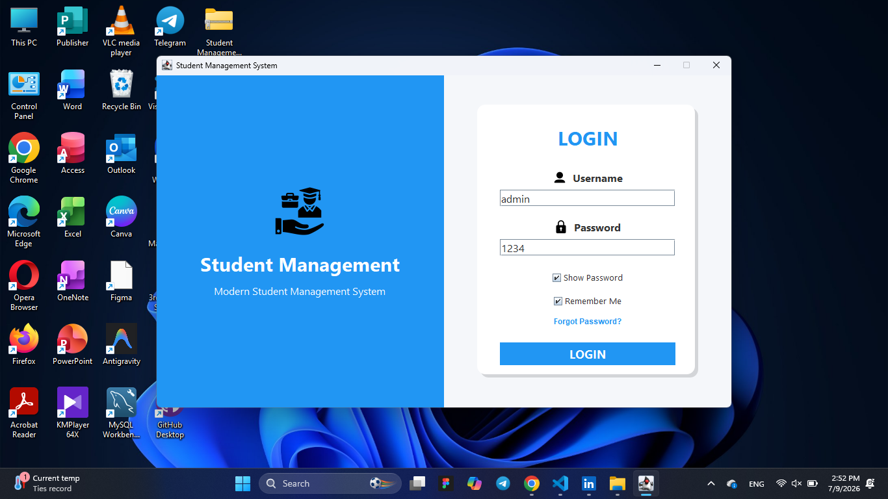
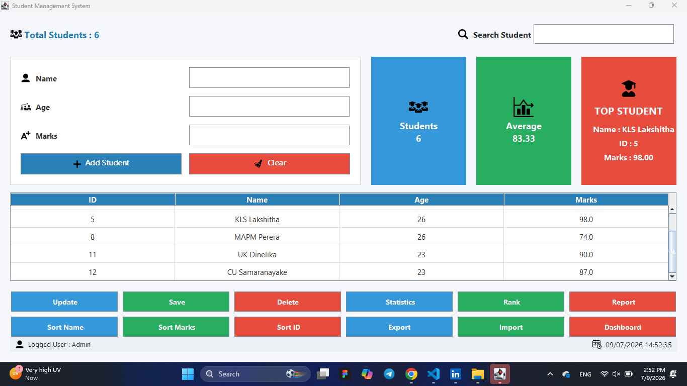
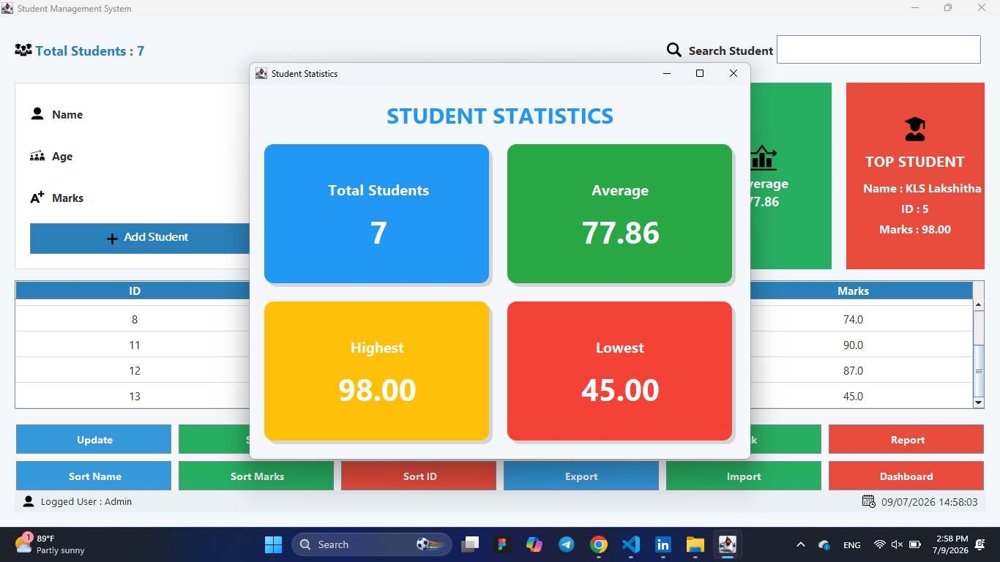
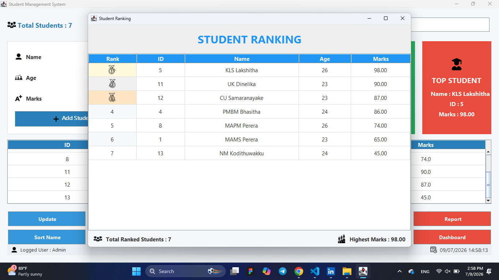
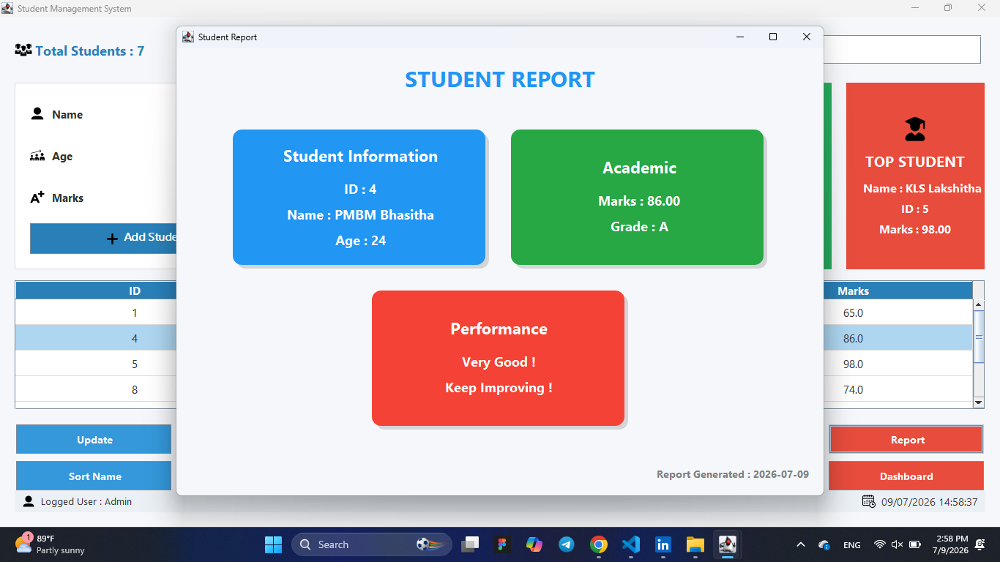
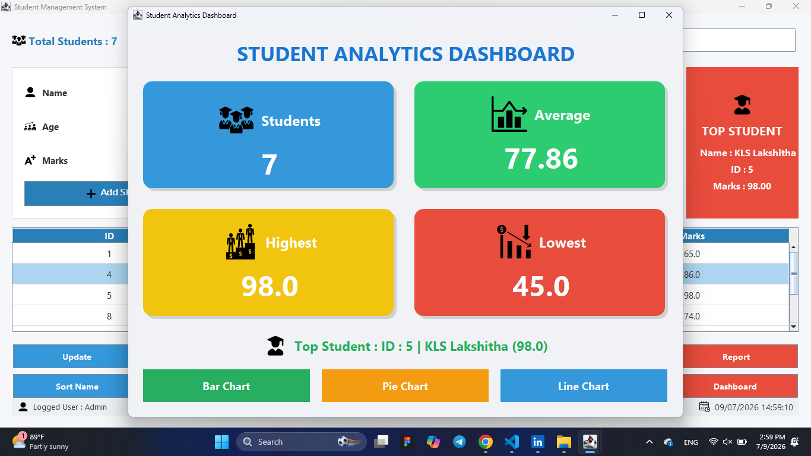
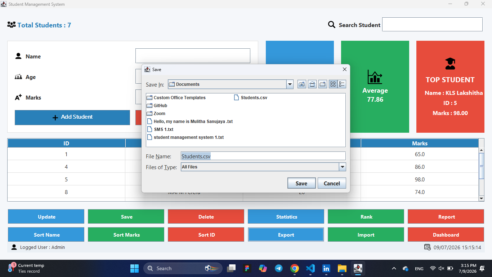

<div align="center">

# 🎓 Student Management System

<p align="center">

</p>


A modern **Java Swing Student Management System** developed to manage student records efficiently with an attractive desktop interface.

⭐ If you like this project, don't forget to **Star** this repository.

</div>

---

# 📑 Table of Contents

- 📖 Overview
- ✨ Features
- 🛠 Technologies
- 📂 Project Structure
- 🚀 Installation
- 📷 Screenshots
- 🔮 Future Improvements
- 👨‍💻 Author
- 📄 License

---

# 📖 Overview

The **Student Management System** is a desktop application developed using **Java Swing**.

It enables users to perform all essential student management operations such as:

- Student Registration
- Searching
- Updating
- Deleting
- Ranking
- Statistics
- Reports
- Import & Export

The application also provides graphical analysis using **JFreeChart**.

---

# ✨ Features

| Feature | Status |
|---------|---------|
| 🔐 Login System | ✅ |
| ➕ Add Student | ✅ |
| ✏ Update Student | ✅ |
| ❌ Delete Student | ✅ |
| 🔍 Search Student | ✅ |
| 📊 Statistics Dashboard | ✅ |
| 🏆 Student Ranking | ✅ |
| 📈 Pie Chart | ✅ |
| 📉 Line Chart | ✅ |
| 📄 Report Generation | ✅ |
| 📤 Export CSV | ✅ |
| 📥 Import CSV | ✅ |

---

# 🛠 Technologies Used

| Technology | Purpose |
|------------|----------|
| Java | Programming Language |
| Java Swing | GUI Development |
| JDBC | Database Connection |
| MySQL | Database |
| Git | Version Control |
| GitHub | Repository Hosting |
| JFreeChart | Charts & Statistics |

---

# 📂 Project Structure

```text
Student Management System
│
├── icons/
├── lib/
│
├── DashboardFrame.java
├── LoginFrame.java
├── StudentGUI.java
├── StatisticsFrame.java
├── RankFrame.java
├── ReportCardFrame.java
├── LineChartFrame.java
├── ChartFrame.java
├── DBConnection.java
├── Student.java
├── Main.java
│
├── README.md
└── .gitignore
```

---

# 🚀 Installation

### 1 Clone Repository

```bash
git clone https://github.com/mamsperera/Student-Management-System.git
```

---

### 2 Open Project

Open the project using:

- VS Code
- IntelliJ IDEA
- Eclipse
- NetBeans

---

### 3 Add Libraries

Required libraries

- mysql-connector-j
- jfreechart

---

### 4 Configure Database

Update your MySQL credentials inside

```
DBConnection.java
```

---

### 5 Run Project

Run

```
LoginFrame.java
```

---

# 📷 Screenshots

## 🔐 Login Screen



---

## 🏠 Main Dashboard




---

## 📊 Statistics




---

## 🏆 Student Ranking




---

## 📄 Report Generation




---

## 🏠 Dashboard




---

## 📤 Export




---


# 🔮 Future Improvements

- 👤 Multi User Login
- 🧑‍🎓 Student Photo Upload
- 📄 PDF Report Export
- 📧 Email Notification
- 📅 Attendance Management
- 🌙 Dark Mode
- ☁ Cloud Database
- 🔐 Role Based Authentication

---

# 👨‍💻 Author

## Mams Perera

Software Engineering Undergraduate

GitHub

https://github.com/mamsperera

---

# 📄 License

This project was developed for educational purposes.

---

<div align="center">

### ⭐ Star this repository if you found it useful!

Made with ❤️ using Java Swing

</div>